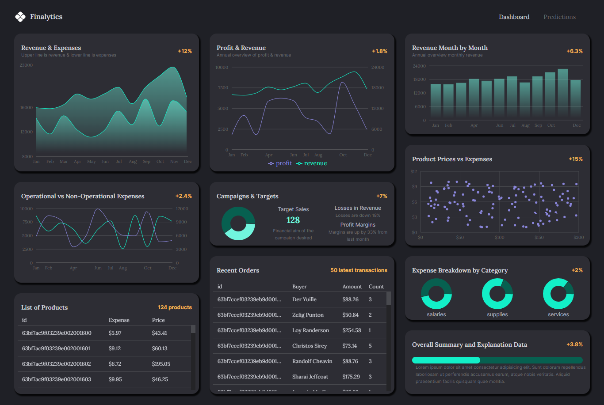
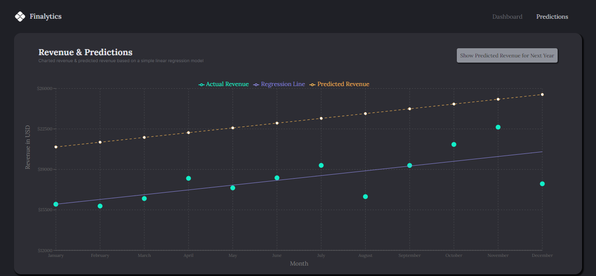

# Financial Dashboard with Predictions using Machine Learning 

## Key Features
### Charts with dynamic data from backend
- Area Chart
- Bar Chart
- Line Charts
- Pie Chart
- Mui DataGrid
- Advanced Mongodb schema design
### Predictions
- Predictions using regression

## Charts Page


## Predictions Page
;


## Available scripts

### First, run the development server

```
cd server &&
bash
npm run dev
# or
yarn dev
# or
pnpm dev
```

### Then, run the client

```
cd client &&
bash 
npm start
```

Open [http://localhost:3000](http://localhost:3000) with your browser to see the result.

The page will reload when you make changes.\
You may also see any lint warnings in the console.

## Deployment

You can find a demo of this financial dashboard at [finalytics](https://finalytics-jade.vercel.app/)